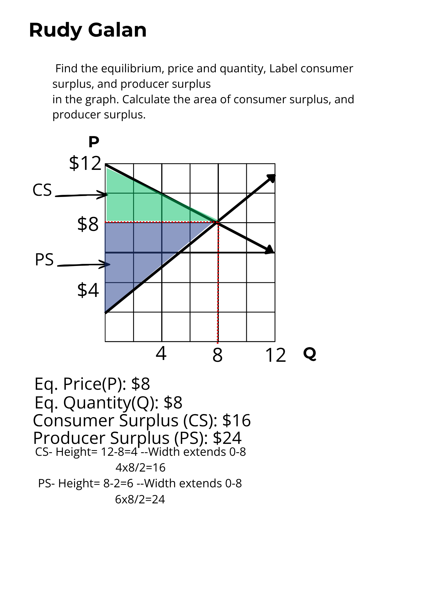
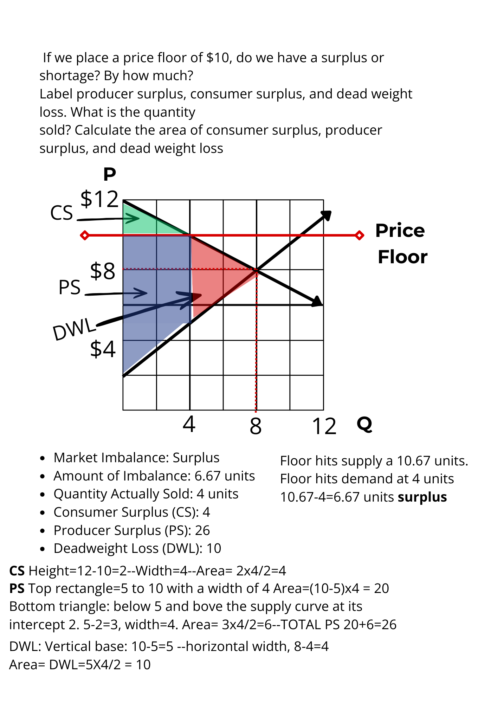
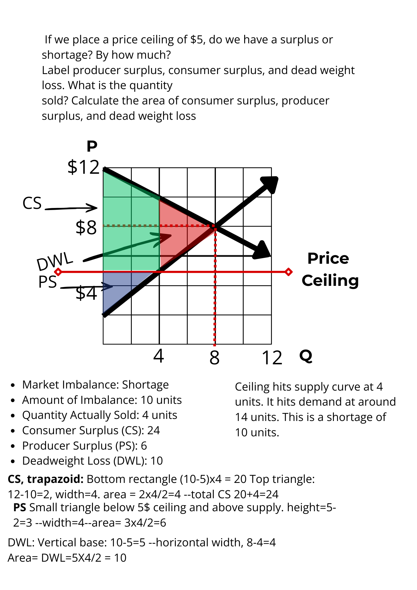

**Part of the Alamo Colleges 2302 Economics Track — Module 01**

## 1. Executive Summary: The Physics of Human Incentives

Most observers view markets as chaotic, emotional, or purely political arenas. In reality, they operate like thermodynamic systems governed by strict laws of physics and human incentives. When a system is left unconstrained, capital and resources flow efficiently. When artificial boundaries are introduced, that energy does not disappear—it degrades into structural friction. 

By modeling a closed microeconomic system, we can mathematically predict exactly how human participants will react to three distinct structural states:

1. **The Unconstrained System (Perfect Equilibrium):** The baseline of maximum efficiency. Prices naturally settle where the effort to produce matches the desire to consume. *Human Reaction:* Transactions flow smoothly without anxiety. Consumers find exactly what they need, and producers clear their inventory with predictable margins. Zero energy is wasted.
2. **The Artificial Cap (Price Ceiling):** A legal maximum price forced below equilibrium (e.g., municipal rent control). *Human Reaction:* Politicians are seen as heroes by people on the left. Consumers see an artificial bargain and immediately scramble to hoard the asset, creating a massive spike in demand. Meanwhile, producers see their profit margins legally destroyed; they stop building, pull their capital out, and abandon the market. The inevitable result is a systemic **shortage** and degraded infrastructure. What is their incentive to build if not building? 
3. **The Artificial Minimum (Price Floor):** A legal minimum price forced above equilibrium (e.g., agricultural price props). *Human Reaction:* This is an example of an inefficient system that doesn't have to provide maximum value. Aligned with government agencies and people who have zero downside risk. Producers see a guaranteed high payout and flood the system with maximum manufacturing volume. Conversely, consumers look at the inflated price tag and simply walk away, refusing to buy. The inevitable result is a systemic **surplus** of dead, unbought inventory rotting on the shelves.

When the "invisible hand" is not left to its own devices, bad things happen. Builders stop building or banks take tons of risk with others money because they can't fail. Both cause systemic leakage in different areas, and in both cases, everyone loses. This is the implications of price control measures that align with communist or socialist societies. 

---

## 2. Model 01: Unconstrained Market Equilibrium

When the market is left to its own accord, the supply and demand will dictate the price leading to an equilibrium, or a minimal loss of energy in the system. 

### Quantitative Breakdown:
* **Equilibrium Vector:** $(Q^* = 8, P^* = \$8)$
* **Consumer Surplus (CS):** Bounded by the maximum demand intercept $(\$12)$ and market price $(\$8)$.
    $$\text{CS} = \frac{(12 - 8) \times 8}{2} = 16$$
* **Producer Surplus (PS):** Bounded by market price $(\$8)$ and the baseline supply intercept $(\$2)$.
    $$\text{PS} = \frac{(8 - 2) \times 8}{2} = 24$$
* **System Friction (DWL):** **0**. Total potential utility is maximized at **40**.

---

## 3. Model 02: High Artificial Boundary (Price Floor = $10)

Imposing a legal minimum price above the equilibrium price restricts consumer participation and creates structural asset accumulation (a market surplus). People who cannot afford to buy above $10 will be priced out the market and flood toward substitutions or alternatives. This may lead to the customer learning to "live without" a product, having structural implications in the future. There is a surplus of "stuff" and not enough customers to buy it. The red indicates the leakage in the system. 

### Quantitative Breakdown:
* **Throttled Quantity:** At **$10**, $Q_d = 4$ and $Q_s = 10.67$. The system bottlenecks at actual units sold = **4**.
* **Welfare Realignment:**
    * **CS (Triangle):** $\frac{(12 - 10) \times 4}{2} = 4$
    * **PS (Trapezoid):** $\text{Rectangle } [ (10 - 5) \times 4 = 20 ] + \text{Triangle } [ \frac{(5 - 2) \times 4}{2} = 6 ] = 26$
* **Systemic Leakage (Deadweight Loss):** $$\text{DWL} = \frac{(10 - 5) \times (8 - 4)}{2} = 10$$

---

## 4. Model 03: Low Artificial Boundary (Price Ceiling = $5)

Imposing a legal maximum price below equilibrium restricts manufacturer capability and generates structural supply depletion (a market shortage). In this case the customer wants to buy as much possible because it's a bargain, but the company has no incentive to produce more. The producing cannot keep up with the demand, therefore a shortage is created, max scarcity, but low price. If its a low price, yet you can't get it, is it even worth it? *pictures a care package dropped in a third world country and people swarming the package because they havent eaten in days* The food was free. 

### Quantitative Breakdown:
* **Throttled Quantity:** At **$5**, $Q_s = 3$ and $Q_d = 10$. The system bottlenecks at actual units sold = **3**.
* **Welfare Realignment:**
    * **CS (Trapezoid):** $\text{Rectangle } [ (7.8 - 5) \times 3 = 8.4 ] + \text{Triangle } [ \frac{(9 - 7.8) \times 3}{2} = 1.8 ] = 10.2$
    * **PS (Triangle):** $\frac{(5 - 2) \times 3}{2} = 4.5$
* **Systemic Leakage (Deadweight Loss):**
    $$\text{DWL} = \frac{(7.8 - 5) \times (5 - 3)}{2} = 2.8$$

---

## 5. Architectural Conclusions & Macro Application

Mathematical models are only as valuable as their real-world utility. When transitioning from microeconomic theory to macro-scale capital deployment, these geometric boundaries explain exactly why markets break—and where opportunity hides.

### I. The Law of Conservation of Efficiency
In physics, energy is conserved but can be degraded into friction or heat loss. In economics, potential value is conserved but degraded into Deadweight Loss.

**Q: Looking at the identical total maximum pool value of 40 across all three models, how does this prove that artificial interventions cannot "create" wealth, but rather act as a structural friction that converts pure human utility into deadweight loss?**

> The fact that every model tops out at the same 40 units shows we’re in a closed system. The maximum total value that can be created is fixed. In a clean market, that full amount gets realized. Price floors and ceilings don’t add anything to the pool. They block some trades that would have made both sides better off, so part of the potential value never appears. That lost value is deadweight loss — not money moved from one pocket to another, but value that simply doesn’t get created.
>
> People still make the real decisions. A buyer won’t pay more than something is worth to them or more than they have. A seller won’t accept less than it costs to produce plus a return worth their time. Those refusals are what push prices up or down. Artificial rules override those signals. The result is too much supply on one side, shortages on the other, and a permanent loss of the deals that never happened.
>
> Printing money doesn’t break the closed-system rule either. It doesn’t add real goods or services to the pool. It just creates more claims on the same output, which pushes prices higher. Inflation is what that looks like. Real wealth still comes from actual production and voluntary exchange. The printing press only changes how the claims are distributed and weakens the unit we use to measure everything.

### II. Identifying Bottlenecks in Real Estate & Infrastructure
A price ceiling artificially caps potential revenue, perfectly mirroring policies like municipal rent control in a housing market.

**Q: When analyzing the physical cutoff line in Model 03, how does this mathematical shortage explain why capital inevitably flees constrained real estate markets, leading to empty pipelines and a lack of new supply for the very people the policy was meant to assist?**

> Adam Smith’s point still holds: people produce and invest to earn a return, not out of charity. When that return is artificially capped, the incentive to build, maintain, or improve disappears. Imagine a baker who makes excellent bread. Demand is high, but a rule prevents him from charging more than a fixed low price. He has no reason to bake extra loaves or upgrade his ovens. He sticks to the amount that still covers his costs and effort. The result is a permanent shortage. People who want the bread can’t get it, and the baker never expands.
>
> The same mechanism operates in real estate. When rent control caps what landlords and developers can earn, the expected return on new construction or major renovations falls below what capital can earn elsewhere. Money flows to other markets or other asset classes instead. Existing owners have less incentive to maintain quality or add units. Over time, the physical supply shrinks or stagnates even as population and demand grow. The mathematical shortage on the graph becomes real buildings that never get built and units that never get added. The people the policy claimed to protect end up competing for a smaller, lower-quality stock of housing.

### III. The Operator’s View on Systemic Asymmetry
Structural models are the radar for deploying capital. Identifying where a market is artificially compressed is the first step to finding alpha.

**Q: How does mapping the exact difference between Consumer Surplus and Producer Surplus allow an operator to spot artificially suppressed markets, and how can this framework be used to position capital in unconstrained equilibrium zones for maximum asymmetry?**

> The gap between consumer surplus and producer surplus reveals where the system is being squeezed. In a clean market, both sides capture value and the total is maximized. When a price ceiling or floor is imposed, one side’s surplus gets artificially inflated while the other’s shrinks — and part of the total disappears as deadweight loss. That imbalance is the signal. It shows you exactly where incentives have been distorted and where capital is likely to exit or avoid entering.
>
> Money behaves like energy. It flows toward areas where it can do work and earn a return. When rules cap revenue or force prices below what clears the market, capital leaks out. You see it in businesses that start with low prices to gain traction, then slowly raise them until they find the real equilibrium. Governments do the same thing at scale with price controls. The money doesn’t vanish — it simply moves to less constrained markets. Knowing where the distortion is lets you position on the other side of the constraint, where equilibrium is still allowed to form.
>
> Shortages created by artificial rules can also become opportunities if you can supply what the constrained players can no longer provide efficiently. The edge comes from understanding the flow before the crowd does. Unconstrained zones — markets where price can still move freely to balance supply and demand — are where the asymmetry is greatest. That’s where capital compounds with the least friction.
