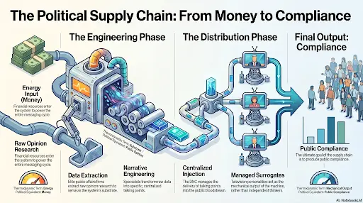
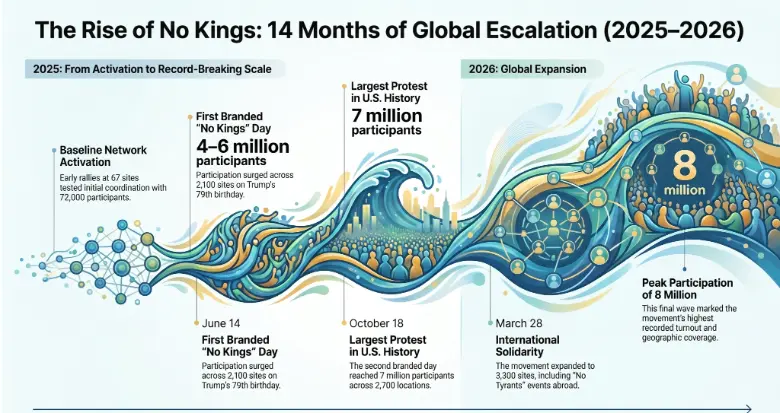

*This is Part I of **The Cognitive Supply Chain** series—a mechanical breakdown of manufactured consensus. [Read Part II here (Link coming soon)].*

***

People consume television as reality. You watch the news, scroll your feed, and absorb the narrative. But have you ever wondered why every politician, pundit, and campaign surrogate suddenly repeats the exact same phrases on the exact same day?

This is not a coincidence. This is the engineering of actors scripting your vocabulary, shaping your beliefs, and manufacturing a mindless consensus. You are not mindless. You are the substrate in a system engineered to dictate your thoughts in minute detail.

## From Capital Inputs to Autonomous Belief Propagation

The system is engineered like a hard science, yet distributed as a philosophy. Like a thermodynamic cycle, it requires a specific stepwise process: energy (money) enters the system, acts upon a substrate (public opinion), and produces a mechanical output (compliance). Then the compliance acts on the system creating massive return on investment.

Public affairs firms extract raw data through opinion research. They pass this substrate to narrative engineers. The resulting talking points are centralized by the Democratic National Committee and injected into the public bloodstream through highly managed surrogates aka your news anchors and influencers. The faces you see on television and your phone are not thinking for themselves. They are merely the output of the machine.

The final injection phase exploits human evolutionary biology. Gossip and tribal signaling—once survival mechanisms—serve as free, self-replicating distribution channels. Once the narrative is injected, the system requires no further energy input. Blind belief compounds autonomously.

> "Without gossip, there would be no society. In short, gossip is what makes human society as we know it possible."
> — Robin Dunbar, *Gossip in Evolutionary Perspective*

> "We are the only mammals that can cooperate with numerous strangers because only we can invent fictional stories, spread them around, and convince millions of others to believe in them."
> — Yuval Noah Harari, *Sapiens*

> "When you plant a fertile meme in my mind you literally parasitize my brain, turning it into a vehicle for the meme's propagation in just the way that a virus may parasitize the genetic mechanism of a host cell."
> — Richard Dawkins, *The Selfish Gene*

> "If we understand the mechanism and motives of the group mind, it is now possible to control and regiment the masses according to our will without their knowing it."
> — Edward Bernays, *Propaganda*

## Internal Disputes, Organizational Layering, and Shifting Objectives

Consider the "No Kings" rallies of 2025 and 2026. On the surface, millions mobilized in a spontaneous, organic uprising. The facts tell a different story.

In 2024, a Reddit user named "Evolved_Fungi" launched the "50501 Movement" to organize unified, simultaneous national action. Right before the flagship 2025 protest, this founder published the following message before vanishing entirely:

> "So there is everything, for complete transparency from my perspective. No matter how any of this might get distorted or twisted to fit some narrative that I'm not fit to be here, I've always remained faithful to the very first ideals of this movement. That is a movement with ordinary people doing extraordinary things... What to do from here? I am not sure. But I have no plans of stepping down unless and until there's a system in place to oversee 50501 without any other conflicts of interest playing into the roles... And now I've learned that there's a petition to have me removed."

What began as a well-intentioned grassroots movement was hijacked by actors seeking absolute power. The founder was either threatened, paid off, or eliminated—as there is no trace of him/her any longer. Socialists preach a utopia of equality, but utopias demand absolute conformity. Dissenters aren't debated; they are purged.

> "Popper believed that any idea of Utopia is necessarily closed owing to the fact that it chokes its own refutations. The simple notion of a good model for society that cannot be left open for falsification is totalitarian." 
> — Nassim Taleb, *Fooled by Randomness*

The new operators immediately shifted the goalposts. The demands mutated from simple anti-administration sentiment to the total abolition of ICE, the removal of Elon Musk from federal affairs, and the reinstatement of rescinded DEI initiatives. Like a hostile corporate takeover, extreme actors used 50501 as a shell. They drained the host system of its resources to launder money and wage psychological warfare.

To understand the sheer momentum of this engineered takeover, look at the scaling data:

> [Nationwide 'No Kings' demonstrations draw millions to streets](https://www.youtube.com/watch?v=hHcPN2ln-Vw) — Footprint of the centralized mobilization network during peak execution phase.

## Legal Structures Enabling Anonymous Capital Flows

The ideology had momentum, but it needed a physical component. Enter Indivisible. Founded by former democratic staffers, their explicit goal was to reverse-engineer the Tea Party's successful 2016 electoral momentum.

They began with a 23-page tactical document acting as the standard operating procedure for local progressive extremists to harass and obstruct officials.

This single document evolved into a corporate triad:
* **Indivisible Project:** A 501(c)(4) dark money nonprofit.
* **Indivisible Civics:** A 501(c)(3) educational arm.
* **Indivisible Action:** A hybrid political action committee.

This legal structure shields massive anonymous donations, maximizes tax deductions under the guise of "education," and funnels money into electoral politics. This capital is not funded by ordinary citizens. It operates as a pipeline for foreign and elites seeking to manipulate the USA for their own strategic objectives.

U.S. federal law prohibits foreign nationals from directly donating to political campaigns due to the influence they have, yet Swiss billionaire Hansjörg Wyss utilizes entities like the Berger Action Fund to route hundreds of millions of dollars into the Sixteen Thirty Fund—a central hub for progressive dark money. This is only one example.

By exploiting these 501(c)(4) tax loopholes, foreign actors legally finance policy manipulation and domestic ballot initiatives, from the shadows. Domestic mega-donors, such as George Soros via the Open Society Policy Center, deploy this exact same architecture.

This is weaponized capital. Morality does not factor into the equation. International and domestic entities deploy this architecture to bypass democratic friction, reshaping policy to align strictly with their own strategic yields.

This invisible capital funded the 3,300 simultaneous protest locations worldwide. By rebranding international events with localized, high-ROI phrases like "No Dictators," they ensured the global messaging remained uniformly targeted.

Watching these systems operate in the wild changes how you view everyday interaction. When someone tells you, "hey, watch this show" or "look at this reel!", you start to question it. You question if a partner in life has been compromised by the system, and you calculate how to defend against it. You see how a single engineered phrase can dictate the beliefs of the people standing right in front of you. The initial anger fades, and the impulse to take notes takes over. This is a signal. This is exactly how I got started writing this. I don't care about their specific political targets; I care about the foundational architecture they use to hit them. When a centralized machine spends billions of dollars to destroy specific targets, my instinct is to figure out what that target threatens. Whatever breaks their system is usually worth defending.

## Specialized Roles Across Legal, Digital, Mass, and Tactical Functions

The scale of the "No Kings Coalition" was a feat of modular architecture. Over 200 progressive groups formed a distributed operating system.

* **The ACLU** supplied the institutional backbone, providing legal scaffolding and narrative discipline.
* **MoveOn** weaponized its massive digital network for rapid mobilization and small-dollar donations.
* **The Third Act Movement** activated wealthy retirees, providing an intergenerational front that signaled stability and consensus.
* **Organized labor (SEIU, AFT, AFGE)** delivered raw mass and street-level density.
* **The Party for Socialism and Liberation (PSL)** managed tactical discipline, chant coordination, and route planning, executing their explicit long-term goal of replacing capitalism.

Like an optimized structure under load, each organization covered a weakness the others could not support alone. They did not need perfect ideological alignment. They only needed enough shared momentum to keep the engine running.

You observe these events and hear identical slogans, assuming you are witnessing organic human nature. You are not. You are observing the friction-free execution of a highly capitalized supply chain.

> "Social engineering is a term which has been used to refer to efforts in influencing particular attitudes and social behaviors on a large scale. This is often undertaken by governments, but may also be carried out by mass media, academia or private groups in order to produce desired characteristics in a target population."

You are watching a highly capitalized system dictate the actions of a compliant populace. To reclaim your mind, you must first see the strings.

The next time a narrative scales across your feed and resonates perfectly with your worldview—pause. Audit the input. Trace the energy source. This teardown is not about political persuasion; it is about cognitive sovereignty.

As I hold as a standard for my own inner circle: I do not care what your stance is. I care that your conclusions are the output of your own rigorous processing, not the mechanical output of a manufactured supply chain. Disagreement is data. Blind compliance is your system failure.

***

**In Part II, we deconstruct the transmission layer: how elite polling syndicates and algorithmic processing capture this exact capital and convert it into the synchronized talking points you hear on the evening news.** 

---

### Raw Data 
* **The Sixteen Thirty Fund & Berger Action Fund:** Financial disclosures verify that Swiss billionaire Hansjörg Wyss utilizes the 501(c)(4) Berger Action Fund to route hundreds of millions of dollars into the Sixteen Thirty Fund, a central hub for undisclosed progressive political spending.
* **Open Society Policy Center (Action Fund):** George Soros utilizes this 501(c)(4) lobbying group to funnel hundreds of millions into progressive super PACs and state-level initiatives.
* **Indivisible's Architecture:** The Indivisible movement originated as a 23-page document written by former Democratic staffers to reverse-engineer Tea Party tactics, eventually scaling into a heavily funded 501(c)(3) and 501(c)(4) corporate structure.
* **The 50501 Movement & No Kings Protests:** Scaling data confirms the orchestrated growth of these protests, mobilizing from initial network activations to approximately 8 million participants across 3,300 sites worldwide.
